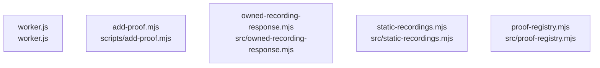

# dependency-map

[解析トップへ戻る](../README.md)

内容確認したソースの静的依存関係。PythonはAST、JavaScript／TypeScriptはimport文の字句抽出です。型だけのimport、再export、コメントや動的importの扱いには制限があり、ランタイム依存の完全なグラフではありません。

## 要素の説明

### n-scripts-add-proof-mjs-015bbd

確認済みファイル: `scripts/add-proof.mjs`

解析: 字句抽出。静的なimport／export参照です。関数の実行順序やHTTP通信は表していません。

- `node:fs/promises` → 外部・標準ライブラリ・別名など。ローカル対応先は未確定
- `node:path` → 外部・標準ライブラリ・別名など。ローカル対応先は未確定
- `node:url` → 外部・標準ライブラリ・別名など。ローカル対応先は未確定
- `../src/proof-registry.mjs` → `src/proof-registry.mjs`（内容確認済み）

[詳細な図と説明を見る](n-scripts-add-proof-mjs-015bbd/README.md)

### n-src-owned-recording-response-mjs-4f5c2b

確認済みファイル: `src/owned-recording-response.mjs`

解析: 字句抽出。静的なimport／export参照です。関数の実行順序やHTTP通信は表していません。

宣言: `serveOwnedRecording`

- `./static-recordings.mjs` → `src/static-recordings.mjs`（内容確認済み）

[詳細な図と説明を見る](n-src-owned-recording-response-mjs-4f5c2b/README.md)

### n-src-proof-registry-mjs-5ec9eb

確認済みファイル: `src/proof-registry.mjs`

解析: 字句抽出。静的なimport／export参照です。関数の実行順序やHTTP通信は表していません。

宣言: `text`, `publicEvidenceUrl`, `validateProofEntry`, `validateProofRegistry`, `addProofEntry`

- `node:crypto` → 外部・標準ライブラリ・別名など。ローカル対応先は未確定

[詳細な図と説明を見る](n-src-proof-registry-mjs-5ec9eb/README.md)

### n-src-static-recordings-mjs-f4dfb9

確認済みファイル: `src/static-recordings.mjs`

解析: 字句抽出。静的なimport／export参照です。関数の実行順序やHTTP通信は表していません。

宣言: `byteRange`, `ifRangeMatches`, `sliceStream`, `readBounded`, `serveStaticRecording`

- `./films.mjs` → `src/films.mjs`（一覧確認・内容未読）

[詳細な図と説明を見る](n-src-static-recordings-mjs-f4dfb9/README.md)

### n-worker-js-2d8aad

確認済みファイル: `worker.js`

解析: 字句抽出。静的なimport／export参照です。関数の実行順序やHTTP通信は表していません。

宣言: `productRedirect`

- `./src/owned-recording-response.mjs` → `src/owned-recording-response.mjs`（内容確認済み）
- `./src/owned-aliases.mjs` → `src/owned-aliases.mjs`（内容確認済み）
- `./src/products.mjs` → `src/products.mjs`（内容確認済み）
- `./src/static-recordings.mjs` → `src/static-recordings.mjs`（内容確認済み）
- `./src/inquiries.mjs` → `src/inquiries.mjs`（内容確認済み）

[詳細な図と説明を見る](n-worker-js-2d8aad/README.md)

