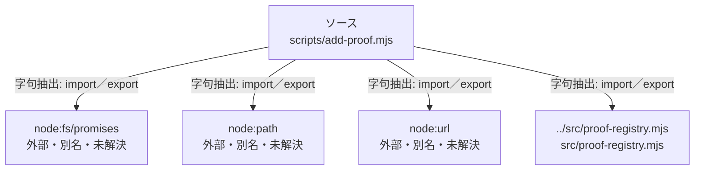

# dependency-map/n-scripts-add-proof-mjs-015bbd

[解析トップへ戻る](../../README.md)

確認済みファイル: `scripts/add-proof.mjs`

解析: 字句抽出。静的なimport／export参照です。関数の実行順序やHTTP通信は表していません。

- `node:fs/promises` → 外部・標準ライブラリ・別名など。ローカル対応先は未確定
- `node:path` → 外部・標準ライブラリ・別名など。ローカル対応先は未確定
- `node:url` → 外部・標準ライブラリ・別名など。ローカル対応先は未確定
- `../src/proof-registry.mjs` → `src/proof-registry.mjs`（内容確認済み）

## 要素の説明

### n-node-fs-promises-6b0834

参照名: `node:fs/promises`

ローカルのソース対応先を確定できませんでした。外部ライブラリ、標準ライブラリ、型別名などを区別する追加確認が必要です。

### n-node-path-78811c

参照名: `node:path`

ローカルのソース対応先を確定できませんでした。外部ライブラリ、標準ライブラリ、型別名などを区別する追加確認が必要です。

### n-node-url-d0cb3a

参照名: `node:url`

ローカルのソース対応先を確定できませんでした。外部ライブラリ、標準ライブラリ、型別名などを区別する追加確認が必要です。

### n-src-proof-registry-mjs-2daa62

参照名: `../src/proof-registry.mjs`

対応する実在ソース: `src/proof-registry.mjs`。内容確認済み。

### source

`scripts/add-proof.mjs` の内容を確認しました。

