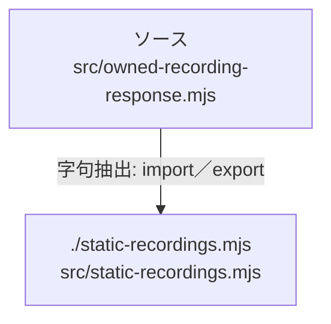

# dependency-map/n-src-owned-recording-response-mjs-4f5c2b

[解析トップへ戻る](../../README.md)

確認済みファイル: `src/owned-recording-response.mjs`

解析: 字句抽出。静的なimport／export参照です。関数の実行順序やHTTP通信は表していません。

宣言: `serveOwnedRecording`

- `./static-recordings.mjs` → `src/static-recordings.mjs`（内容確認済み）

## 要素の説明

### n-static-recordings-mjs-e146a7

参照名: `./static-recordings.mjs`

対応する実在ソース: `src/static-recordings.mjs`。内容確認済み。

### source

`src/owned-recording-response.mjs` の内容を確認しました。

