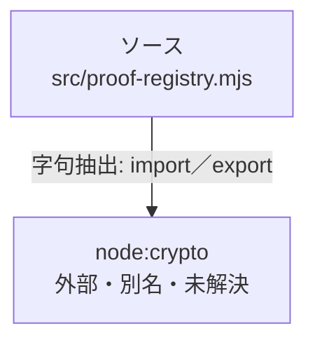

# dependency-map/n-src-proof-registry-mjs-5ec9eb

[解析トップへ戻る](../../README.md)

確認済みファイル: `src/proof-registry.mjs`

解析: 字句抽出。静的なimport／export参照です。関数の実行順序やHTTP通信は表していません。

宣言: `text`, `publicEvidenceUrl`, `validateProofEntry`, `validateProofRegistry`, `addProofEntry`

- `node:crypto` → 外部・標準ライブラリ・別名など。ローカル対応先は未確定

## 要素の説明

### n-node-crypto-c7dfc5

参照名: `node:crypto`

ローカルのソース対応先を確定できませんでした。外部ライブラリ、標準ライブラリ、型別名などを区別する追加確認が必要です。

### source

`src/proof-registry.mjs` の内容を確認しました。

