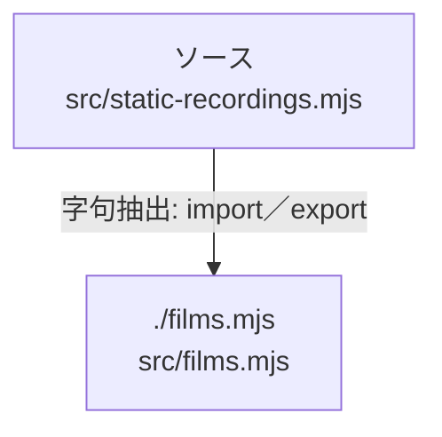

# dependency-map/n-src-static-recordings-mjs-f4dfb9

[解析トップへ戻る](../../README.md)

確認済みファイル: `src/static-recordings.mjs`

解析: 字句抽出。静的なimport／export参照です。関数の実行順序やHTTP通信は表していません。

宣言: `byteRange`, `ifRangeMatches`, `sliceStream`, `readBounded`, `serveStaticRecording`

- `./films.mjs` → `src/films.mjs`（一覧確認・内容未読）

## 要素の説明

### n-films-mjs-7294bd

参照名: `./films.mjs`

対応する実在ソース: `src/films.mjs`。内容は未読。

### source

`src/static-recordings.mjs` の内容を確認しました。

