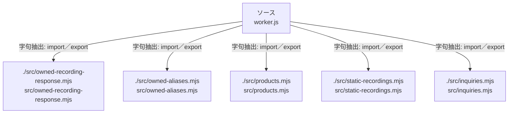

# dependency-map/n-worker-js-2d8aad

[解析トップへ戻る](../../README.md)

確認済みファイル: `worker.js`

解析: 字句抽出。静的なimport／export参照です。関数の実行順序やHTTP通信は表していません。

宣言: `productRedirect`

- `./src/owned-recording-response.mjs` → `src/owned-recording-response.mjs`（内容確認済み）
- `./src/owned-aliases.mjs` → `src/owned-aliases.mjs`（内容確認済み）
- `./src/products.mjs` → `src/products.mjs`（内容確認済み）
- `./src/static-recordings.mjs` → `src/static-recordings.mjs`（内容確認済み）
- `./src/inquiries.mjs` → `src/inquiries.mjs`（内容確認済み）

## 要素の説明

### n-src-inquiries-mjs-479536

参照名: `./src/inquiries.mjs`

対応する実在ソース: `src/inquiries.mjs`。内容確認済み。

### n-src-owned-aliases-mjs-4a5f0e

参照名: `./src/owned-aliases.mjs`

対応する実在ソース: `src/owned-aliases.mjs`。内容確認済み。

### n-src-owned-recording-response-mjs-e40ec8

参照名: `./src/owned-recording-response.mjs`

対応する実在ソース: `src/owned-recording-response.mjs`。内容確認済み。

### n-src-products-mjs-96da6c

参照名: `./src/products.mjs`

対応する実在ソース: `src/products.mjs`。内容確認済み。

### n-src-static-recordings-mjs-36b1ea

参照名: `./src/static-recordings.mjs`

対応する実在ソース: `src/static-recordings.mjs`。内容確認済み。

### source

`worker.js` の内容を確認しました。

