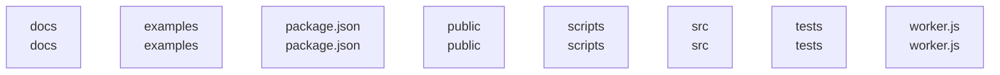

# overall-architecture

[解析トップへ戻る](../README.md)

# reachmade

Reachmade Labの製品紹介サイト。静的サイト生成とCloudflare Workerを持ちます。

この図はリポジトリ内の構成です。コードを実行した結果やサービス間の通信保証ではありません。

## 対象と根拠

対象: https://github.com/FORIFOR/reachmade

取得ブランチ: `main`

Git tree SHA: `1321243eae3a411f0513f0ee62ec36d2c6d28c06`

ファイル一覧: 607件。内容確認: 10件。全ファイルの意味解析ではありません。

## 解析の制約

実コードの取得は入口、マニフェスト、直接参照先を中心とする初回解析です。動的ロード、実行時設定、別リポジトリとの接続、ローカル未コミット変更は未確認です。

## 確認が必要な点

構成図の配置関係と、実際の通信・呼び出し関係を区別してください。README上の機能や精度の記述は動作検証済みという意味ではありません。

## 追加解析

未読の中核モジュールから処理順序・データ保存・状態遷移を追加解析する。実行環境で通信先と機能フラグを照合する。

## 補足

2026-10-11の初回解析スナップショットです。現在のコードとの差分や実行環境は追加確認が必要です。

## 要素の説明

### n-docs-71ab8b

確認したパス: `docs`。配下の登録ファイルは49件。

- `docs/ANIMATED_DEMOS.ja.md`（一覧のみ）
- `docs/ART_DIRECTION_REVIEW.ja.md`（一覧のみ）
- `docs/CONTENT.md`（一覧のみ）
- `docs/CONVERSION_MEASUREMENT_2026-10-02.ja.md`（一覧のみ）
- `docs/DEPLOY_CLOUDFLARE.ja.md`（一覧のみ）
- `docs/DESIGN.md`（一覧のみ）
- `docs/HOME_FLAGSHIP_2026-09-19.ja.md`（一覧のみ）
- `docs/HORIO_PREMIUM_FINAL_2026-09-17.md`（一覧のみ）
- `docs/HORIO_PREMIUM_WEB.md`（一覧のみ）
- `docs/MANUAL_VERIFICATION.md`（一覧のみ）
- `docs/MIGRATION_PLAN.ja.md`（一覧のみ）
- `docs/OSS_FOLLOWUP_2026-09-19.md`（一覧のみ）
- `docs/OSS_KIT_V2_REVIEW_2026-09-19.md`（一覧のみ）
- `docs/OSS_VERIFICATION_2026-09-19.md`（一覧のみ）
- `docs/OUTCOME_FIRST_2026-09-19.md`（一覧のみ）
- `docs/OUTCOME_QA_INTEGRATION.md`（一覧のみ）
- `docs/OWNED_SITE_MIGRATION.md`（一覧のみ）
- `docs/PREMIUM_PRODUCT_FILMS.md`（一覧のみ）
- `docs/PRODUCT_FILMS.ja.md`（一覧のみ）
- `docs/PRODUCT_FILMS_QA_2026-09-15.md`（一覧のみ）
- `docs/PRODUCT_LAB.ja.md`（一覧のみ）
- `docs/PROOF_REGISTRY.md`（一覧のみ）
- `docs/QUALITY_SKILLS.md`（一覧のみ）
- `docs/QUIET_CINEMA.md`（一覧のみ）
- `docs/REACHMADE_ROLLOUT_STATUS_2026-09-15.ja.md`（一覧のみ）
- `docs/RELEASE_CHECKLIST.md`（一覧のみ）
- `docs/SAMPLE_CONTRACT.md`（一覧のみ）
- `docs/SIGNATURE_SCENE_2026-09-19.ja.md`（一覧のみ）
- `docs/SITE_ARCHITECTURE.ja.md`（一覧のみ）
- `docs/TESTING.md`（一覧のみ）
- `docs/TOP_LEVEL_HOME_AUDIT_2026-09-17.md`（一覧のみ）
- `docs/browser-check.json`（一覧のみ）
- `docs/content-sources.json`（一覧のみ）
- `docs/design/KIT_SOURCES.md`（一覧のみ）
- `docs/design/UI_QUALITY_KIT.ja.md`（一覧のみ）

[詳細な図と説明を見る](n-docs-71ab8b/README.md)

### n-examples-99345c

確認したパス: `examples`。配下の登録ファイルは1件。

- `examples/sample.mjs`（一覧のみ）

### n-package-json-7030d0

確認したパス: `package.json`。配下の登録ファイルは1件。

- `package.json`（内容確認済み）

### n-public-61c9b2

確認したパス: `public`。配下の登録ファイルは424件。

- `public/_headers`（一覧のみ）
- `public/_redirects`（一覧のみ）
- `public/assets/animated-demos.css`（一覧のみ）
- `public/assets/animated-demos.mjs`（一覧のみ）
- `public/assets/brand-rhythm.css`（一覧のみ）
- `public/assets/draft-operation.mjs`（一覧のみ）
- `public/assets/fifteen-second-films.css`（一覧のみ）
- `public/assets/fonts/LICENSE.md`（一覧のみ）
- `public/assets/fonts/geist-58a6b173d5.woff2`（一覧のみ）
- `public/assets/fonts/geist-6129fc8571.woff2`（一覧のみ）
- `public/assets/fonts/geist-9b6f5ff45b.woff2`（一覧のみ）
- `public/assets/fonts/geist-b7a545bbb0.woff2`（一覧のみ）
- `public/assets/fonts/geist-f689f638f2.woff2`（一覧のみ）
- `public/assets/fonts/geist-mono-16e1d48b6d.woff2`（一覧のみ）
- `public/assets/fonts/geist-mono-5f3d6ad60f.woff2`（一覧のみ）
- `public/assets/fonts/geist-mono-745994b5cd.woff2`（一覧のみ）
- `public/assets/fonts/geist-mono-75b3bedbeb.woff2`（一覧のみ）
- `public/assets/fonts/geist-mono-d67e4a94ba.woff2`（一覧のみ）
- `public/assets/fonts/geist-mono-e27f657e38.woff2`（一覧のみ）
- `public/assets/fonts/instrument-serif-60c06664b5.woff2`（一覧のみ）
- `public/assets/fonts/instrument-serif-6ee678c33f.woff2`（一覧のみ）
- `public/assets/fonts/instrument-serif-a04fc7ed18.woff2`（一覧のみ）
- `public/assets/fonts/instrument-serif-a8c4bd7cd7.woff2`（一覧のみ）
- `public/assets/fonts/zen-kaku-003939e825.woff2`（一覧のみ）
- `public/assets/fonts/zen-kaku-00432691ee.woff2`（一覧のみ）
- `public/assets/fonts/zen-kaku-00a5f2b6fb.woff2`（一覧のみ）
- `public/assets/fonts/zen-kaku-01f1f5066c.woff2`（一覧のみ）
- `public/assets/fonts/zen-kaku-031a908c8a.woff2`（一覧のみ）
- `public/assets/fonts/zen-kaku-03a01cb32d.woff2`（一覧のみ）
- `public/assets/fonts/zen-kaku-03ec750120.woff2`（一覧のみ）
- `public/assets/fonts/zen-kaku-043c609552.woff2`（一覧のみ）
- `public/assets/fonts/zen-kaku-05518ecda1.woff2`（一覧のみ）
- `public/assets/fonts/zen-kaku-066d52c021.woff2`（一覧のみ）
- `public/assets/fonts/zen-kaku-093447bc47.woff2`（一覧のみ）
- `public/assets/fonts/zen-kaku-0a0375c026.woff2`（一覧のみ）

[詳細な図と説明を見る](n-public-61c9b2/README.md)

### n-scripts-16728d

確認したパス: `scripts`。配下の登録ファイルは26件。

- `scripts/add-proof.mjs`（内容確認済み）
- `scripts/build-core.mjs`（一覧のみ）
- `scripts/build.mjs`（一覧のみ）
- `scripts/make-poster-en.py`（一覧のみ）
- `scripts/prepare-media.mjs`（一覧のみ）
- `scripts/product_film_contract.py`（一覧のみ）
- `scripts/record-sample.mjs`（一覧のみ）
- `scripts/serve.mjs`（一覧のみ）
- `scripts/ui-capture.mjs`（一覧のみ）
- `scripts/ui-probe.mjs`（一覧のみ）
- `scripts/ui-quality.mjs`（一覧のみ）
- `scripts/ui-stop-gate.mjs`（一覧のみ）
- `scripts/verify-conversion-path.py`（一覧のみ）
- `scripts/verify-horio-premium.py`（一覧のみ）
- `scripts/verify-inquiry-form.py`（一覧のみ）
- `scripts/verify-lab-experience.py`（一覧のみ）
- `scripts/verify-lab-signature.py`（一覧のみ）
- `scripts/verify-outcome-first.py`（一覧のみ）
- `scripts/verify-owned-artifact.py`（一覧のみ）
- `scripts/verify-owned-sites.py`（一覧のみ）
- `scripts/verify-packaged-films.py`（一覧のみ）
- `scripts/verify-product-films.py`（一覧のみ）
- `scripts/verify-product-landings.py`（一覧のみ）
- `scripts/verify-sample.mjs`（一覧のみ）
- `scripts/verify_home_v4.py`（一覧のみ）
- `scripts/verify_showcase.py`（一覧のみ）

[詳細な図と説明を見る](n-scripts-16728d/README.md)

### n-src-f27fed

確認したパス: `src`。配下の登録ファイルは34件。

- `src/animated-demo-assets.mjs`（一覧のみ）
- `src/copy.mjs`（一覧のみ）
- `src/fifteen-second-films.mjs`（一覧のみ）
- `src/films.mjs`（一覧のみ）
- `src/genie-lp.mjs`（一覧のみ）
- `src/home-flagship.mjs`（一覧のみ）
- `src/home-task-picker.mjs`（一覧のみ）
- `src/home-v4-copy.mjs`（一覧のみ）
- `src/home-v4.mjs`（一覧のみ）
- `src/inquiries.mjs`（内容確認済み）
- `src/inquiry-page.mjs`（一覧のみ）
- `src/lab-experience.mjs`（一覧のみ）
- `src/lab-signature.mjs`（一覧のみ）
- `src/noa-lp.mjs`（一覧のみ）
- `src/oathra-lp.mjs`（一覧のみ）
- `src/outcome-first.mjs`（一覧のみ）
- `src/owned-aliases.mjs`（内容確認済み）
- `src/owned-guides.mjs`（一覧のみ）
- `src/owned-media.mjs`（一覧のみ）
- `src/owned-recording-response.mjs`（内容確認済み）
- `src/premium-film-cuts.mjs`（一覧のみ）
- `src/product-art-direction.mjs`（一覧のみ）
- `src/product-landings.mjs`（一覧のみ）
- `src/products.mjs`（内容確認済み）
- `src/proof-registry.mjs`（内容確認済み）
- `src/redesign-copy.mjs`（一覧のみ）
- `src/redesign.mjs`（一覧のみ）
- `src/redesign/fonts.css`（一覧のみ）
- `src/redesign/redesign.css`（一覧のみ）
- `src/showcase.mjs`（一覧のみ）
- `src/signature-scene.mjs`（一覧のみ）
- `src/site-content.mjs`（一覧のみ）
- `src/site-experience.mjs`（一覧のみ）
- `src/static-recordings.mjs`（内容確認済み）

[詳細な図と説明を見る](n-src-f27fed/README.md)

### n-tests-04d13f

確認したパス: `tests`。配下の登録ファイルは43件。

- `tests/animated-demos.test.mjs`（一覧のみ）
- `tests/art-direction.test.mjs`（一覧のみ）
- `tests/browser-check.py`（一覧のみ）
- `tests/conversion-path.test.mjs`（一覧のみ）
- `tests/draft-operation.test.mjs`（一覧のみ）
- `tests/fifteen-second-films.test.mjs`（一覧のみ）
- `tests/films.test.mjs`（一覧のみ）
- `tests/fixtures/sample-v1-ja.json`（一覧のみ）
- `tests/fixtures/sample-v1-ja.md`（一覧のみ）
- `tests/genie-lp.test.mjs`（一覧のみ）
- `tests/hero-layouts.test.mjs`（一覧のみ）
- `tests/home-flagship.test.mjs`（一覧のみ）
- `tests/home-v4.test.mjs`（一覧のみ）
- `tests/horio-premium.test.mjs`（一覧のみ）
- `tests/http.test.mjs`（一覧のみ）
- `tests/inquiries.test.mjs`（一覧のみ）
- `tests/inquiry-context-ui.test.mjs`（一覧のみ）
- `tests/inquiry-worker.test.mjs`（一覧のみ）
- `tests/lab-experience.test.mjs`（一覧のみ）
- `tests/lab-signature.test.mjs`（一覧のみ）
- `tests/noa.test.mjs`（一覧のみ）
- `tests/oathra-lp.test.mjs`（一覧のみ）
- `tests/outcome-first.test.mjs`（一覧のみ）
- `tests/owned-recording-response.test.mjs`（一覧のみ）
- `tests/owned-sites.test.mjs`（一覧のみ）
- `tests/premium-films.test.mjs`（一覧のみ）
- `tests/product-art-direction.test.mjs`（一覧のみ）
- `tests/product-landings.test.mjs`（一覧のみ）
- `tests/product-rhythms.test.mjs`（一覧のみ）
- `tests/proof-registry.test.mjs`（一覧のみ）
- `tests/recorded-result.test.mjs`（一覧のみ）
- `tests/redesign.test.mjs`（一覧のみ）
- `tests/sample-draft.test.mjs`（一覧のみ）
- `tests/showcase.test.mjs`（一覧のみ）
- `tests/signature-scene.test.mjs`（一覧のみ）

[詳細な図と説明を見る](n-tests-04d13f/README.md)

### n-worker-js-2d8aad

確認したパス: `worker.js`。配下の登録ファイルは1件。

- `worker.js`（内容確認済み）

