# overall-architecture/n-docs-71ab8b

[解析トップへ戻る](../../README.md)

確認したパス: `docs`。配下の登録ファイルは49件。

- `docs/ANIMATED_DEMOS.ja.md`（一覧のみ）
- `docs/ART_DIRECTION_REVIEW.ja.md`（一覧のみ）
- `docs/CONTENT.md`（一覧のみ）
- `docs/CONVERSION_MEASUREMENT_2026-10-02.ja.md`（一覧のみ）
- `docs/DEPLOY_CLOUDFLARE.ja.md`（一覧のみ）
- `docs/DESIGN.md`（一覧のみ）
- `docs/HOME_FLAGSHIP_2026-09-19.ja.md`（一覧のみ）
- `docs/HORIO_PREMIUM_FINAL_2026-09-17.md`（一覧のみ）
- `docs/HORIO_PREMIUM_WEB.md`（一覧のみ）
- `docs/MANUAL_VERIFICATION.md`（一覧のみ）
- `docs/MIGRATION_PLAN.ja.md`（一覧のみ）
- `docs/OSS_FOLLOWUP_2026-09-19.md`（一覧のみ）
- `docs/OSS_KIT_V2_REVIEW_2026-09-19.md`（一覧のみ）
- `docs/OSS_VERIFICATION_2026-09-19.md`（一覧のみ）
- `docs/OUTCOME_FIRST_2026-09-19.md`（一覧のみ）
- `docs/OUTCOME_QA_INTEGRATION.md`（一覧のみ）
- `docs/OWNED_SITE_MIGRATION.md`（一覧のみ）
- `docs/PREMIUM_PRODUCT_FILMS.md`（一覧のみ）
- `docs/PRODUCT_FILMS.ja.md`（一覧のみ）
- `docs/PRODUCT_FILMS_QA_2026-09-15.md`（一覧のみ）
- `docs/PRODUCT_LAB.ja.md`（一覧のみ）
- `docs/PROOF_REGISTRY.md`（一覧のみ）
- `docs/QUALITY_SKILLS.md`（一覧のみ）
- `docs/QUIET_CINEMA.md`（一覧のみ）
- `docs/REACHMADE_ROLLOUT_STATUS_2026-09-15.ja.md`（一覧のみ）
- `docs/RELEASE_CHECKLIST.md`（一覧のみ）
- `docs/SAMPLE_CONTRACT.md`（一覧のみ）
- `docs/SIGNATURE_SCENE_2026-09-19.ja.md`（一覧のみ）
- `docs/SITE_ARCHITECTURE.ja.md`（一覧のみ）
- `docs/TESTING.md`（一覧のみ）
- `docs/TOP_LEVEL_HOME_AUDIT_2026-09-17.md`（一覧のみ）
- `docs/browser-check.json`（一覧のみ）
- `docs/content-sources.json`（一覧のみ）
- `docs/design/KIT_SOURCES.md`（一覧のみ）
- `docs/design/UI_QUALITY_KIT.ja.md`（一覧のみ）

```mermaid
graph TD
    n-docs-design-f63999["design\ndocs/design"]
    n-docs-browser-check-json-7719aa["browser-check.json\ndocs/browser-check.json"]
    n-docs-content-sources-json-1a8bcb["content-sources.json\ndocs/content-sources.json"]
    n-docs-owned-artifact-browser-json-39fbe4["owned-artifact-browser.json\ndocs/owned-artifact-browser.json"]
    n-docs-owned-artifact-migration-json-c8ac75["owned-artifact-migration.json\ndocs/owned-artifact-migration.json"]
    n-docs-owned-site-migration-browser-json-48a89d["owned-site-migration-browser.json\ndocs/owned-site-migration-browser.json"]
    n-docs-owned-site-migration-provenance-json-6b213e["owned-site-migration-provenance.json\ndocs/owned-site-migration-provenance.json"]
    n-docs-routes-json-e3be20["routes.json\ndocs/routes.json"]
```

## 要素の説明

### n-docs-browser-check-json-7719aa

実在パス: `docs/browser-check.json`。1ファイル。

- `docs/browser-check.json`

### n-docs-content-sources-json-1a8bcb

実在パス: `docs/content-sources.json`。1ファイル。

- `docs/content-sources.json`

### n-docs-design-f63999

実在パス: `docs/design`。10ファイル。

- `docs/design/KIT_SOURCES.md`
- `docs/design/UI_QUALITY_KIT.ja.md`
- `docs/design/acceptance.md`
- `docs/design/brand-profiles.md`
- `docs/design/brief.md`
- `docs/design/lp-clarity-2026-09-30.md`
- `docs/design/lp-quality-acceptance-2026-09-30.md`
- `docs/design/references/README.md`
- `docs/design/report-template.md`
- `docs/design/tokens.md`

### n-docs-owned-artifact-browser-json-39fbe4

実在パス: `docs/owned-artifact-browser.json`。1ファイル。

- `docs/owned-artifact-browser.json`

### n-docs-owned-artifact-migration-json-c8ac75

実在パス: `docs/owned-artifact-migration.json`。1ファイル。

- `docs/owned-artifact-migration.json`

### n-docs-owned-site-migration-browser-json-48a89d

実在パス: `docs/owned-site-migration-browser.json`。1ファイル。

- `docs/owned-site-migration-browser.json`

### n-docs-owned-site-migration-provenance-json-6b213e

実在パス: `docs/owned-site-migration-provenance.json`。1ファイル。

- `docs/owned-site-migration-provenance.json`

### n-docs-routes-json-e3be20

実在パス: `docs/routes.json`。1ファイル。

- `docs/routes.json`

