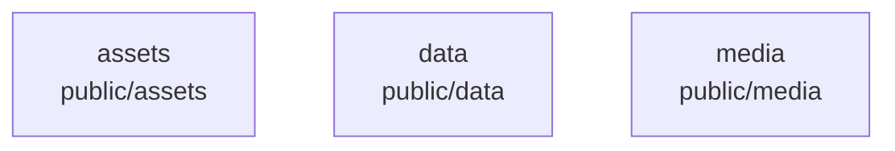

# overall-architecture/n-public-61c9b2

[解析トップへ戻る](../../README.md)

確認したパス: `public`。配下の登録ファイルは424件。

- `public/_headers`（一覧のみ）
- `public/_redirects`（一覧のみ）
- `public/assets/animated-demos.css`（一覧のみ）
- `public/assets/animated-demos.mjs`（一覧のみ）
- `public/assets/brand-rhythm.css`（一覧のみ）
- `public/assets/draft-operation.mjs`（一覧のみ）
- `public/assets/fifteen-second-films.css`（一覧のみ）
- `public/assets/fonts/LICENSE.md`（一覧のみ）
- `public/assets/fonts/geist-58a6b173d5.woff2`（一覧のみ）
- `public/assets/fonts/geist-6129fc8571.woff2`（一覧のみ）
- `public/assets/fonts/geist-9b6f5ff45b.woff2`（一覧のみ）
- `public/assets/fonts/geist-b7a545bbb0.woff2`（一覧のみ）
- `public/assets/fonts/geist-f689f638f2.woff2`（一覧のみ）
- `public/assets/fonts/geist-mono-16e1d48b6d.woff2`（一覧のみ）
- `public/assets/fonts/geist-mono-5f3d6ad60f.woff2`（一覧のみ）
- `public/assets/fonts/geist-mono-745994b5cd.woff2`（一覧のみ）
- `public/assets/fonts/geist-mono-75b3bedbeb.woff2`（一覧のみ）
- `public/assets/fonts/geist-mono-d67e4a94ba.woff2`（一覧のみ）
- `public/assets/fonts/geist-mono-e27f657e38.woff2`（一覧のみ）
- `public/assets/fonts/instrument-serif-60c06664b5.woff2`（一覧のみ）
- `public/assets/fonts/instrument-serif-6ee678c33f.woff2`（一覧のみ）
- `public/assets/fonts/instrument-serif-a04fc7ed18.woff2`（一覧のみ）
- `public/assets/fonts/instrument-serif-a8c4bd7cd7.woff2`（一覧のみ）
- `public/assets/fonts/zen-kaku-003939e825.woff2`（一覧のみ）
- `public/assets/fonts/zen-kaku-00432691ee.woff2`（一覧のみ）
- `public/assets/fonts/zen-kaku-00a5f2b6fb.woff2`（一覧のみ）
- `public/assets/fonts/zen-kaku-01f1f5066c.woff2`（一覧のみ）
- `public/assets/fonts/zen-kaku-031a908c8a.woff2`（一覧のみ）
- `public/assets/fonts/zen-kaku-03a01cb32d.woff2`（一覧のみ）
- `public/assets/fonts/zen-kaku-03ec750120.woff2`（一覧のみ）
- `public/assets/fonts/zen-kaku-043c609552.woff2`（一覧のみ）
- `public/assets/fonts/zen-kaku-05518ecda1.woff2`（一覧のみ）
- `public/assets/fonts/zen-kaku-066d52c021.woff2`（一覧のみ）
- `public/assets/fonts/zen-kaku-093447bc47.woff2`（一覧のみ）
- `public/assets/fonts/zen-kaku-0a0375c026.woff2`（一覧のみ）

## 要素の説明

### n-public-assets-a9d8e7

実在パス: `public/assets`。349ファイル。

- `public/assets/animated-demos.css`
- `public/assets/animated-demos.mjs`
- `public/assets/brand-rhythm.css`
- `public/assets/draft-operation.mjs`
- `public/assets/fifteen-second-films.css`
- `public/assets/fonts/LICENSE.md`
- `public/assets/fonts/geist-58a6b173d5.woff2`
- `public/assets/fonts/geist-6129fc8571.woff2`
- `public/assets/fonts/geist-9b6f5ff45b.woff2`
- `public/assets/fonts/geist-b7a545bbb0.woff2`
- `public/assets/fonts/geist-f689f638f2.woff2`
- `public/assets/fonts/geist-mono-16e1d48b6d.woff2`
- `public/assets/fonts/geist-mono-5f3d6ad60f.woff2`
- `public/assets/fonts/geist-mono-745994b5cd.woff2`
- `public/assets/fonts/geist-mono-75b3bedbeb.woff2`
- `public/assets/fonts/geist-mono-d67e4a94ba.woff2`
- `public/assets/fonts/geist-mono-e27f657e38.woff2`
- `public/assets/fonts/instrument-serif-60c06664b5.woff2`
- `public/assets/fonts/instrument-serif-6ee678c33f.woff2`
- `public/assets/fonts/instrument-serif-a04fc7ed18.woff2`
- `public/assets/fonts/instrument-serif-a8c4bd7cd7.woff2`
- `public/assets/fonts/zen-kaku-003939e825.woff2`
- `public/assets/fonts/zen-kaku-00432691ee.woff2`
- `public/assets/fonts/zen-kaku-00a5f2b6fb.woff2`
- `public/assets/fonts/zen-kaku-01f1f5066c.woff2`

### n-public-data-72576f

実在パス: `public/data`。1ファイル。

- `public/data/real-use-proof.json`

### n-public-media-117fbd

実在パス: `public/media`。72ファイル。

- `public/media/derived/genie/orbit-poster-en.jpg`
- `public/media/derived/manifest.json`
- `public/media/derived/sample/sample-16x9-en.mp4`
- `public/media/derived/sample/sample-16x9.mp4`
- `public/media/derived/sample/sample-9x16-en.mp4`
- `public/media/derived/sample/sample-9x16.mp4`
- `public/media/derived/sample/sample-poster-en.jpg`
- `public/media/derived/sample/sample-poster.jpg`
- `public/media/films/agent-team-design-30s.mp4`
- `public/media/films/genie-30s.jpg`
- `public/media/films/genie-30s.mp4`
- `public/media/films/genie-taskdock-13s.jpg`
- `public/media/films/genie-taskdock-13s.mp4`
- `public/media/films/home-agent-team-13s.jpg`
- `public/media/films/home-agent-team-13s.mp4`
- `public/media/films/home-oathra-13s.jpg`
- `public/media/films/home-oathra-13s.mp4`
- `public/media/films/manifest.json`
- `public/media/films/oathra-15s.jpg`
- `public/media/films/oathra-15s.mp4`
- `public/media/films/oathra-30s.jpg`
- `public/media/films/oathra-30s.mp4`
- `public/media/films/reachmade-15s.jpg`
- `public/media/films/reachmade-15s.mp4`
- `public/media/originals/ai-meeting/avatar-room.png`

