# overall-architecture/n-src-f27fed/group-1

[解析トップへ戻る](../../../README.md)

このグループは表示用の区切りです。独立した実行モジュールではありません。

```mermaid
graph TD
    n-src-redesign-7f09db["redesign\nsrc/redesign"]
    n-src-animated-demo-assets-mjs-ba0181["animated-demo-assets.mjs\nsrc/animated-demo-assets.mjs"]
    n-src-copy-mjs-3ba769["copy.mjs\nsrc/copy.mjs"]
    n-src-fifteen-second-films-mjs-025941["fifteen-second-films.mjs\nsrc/fifteen-second-films.mjs"]
    n-src-films-mjs-80998b["films.mjs\nsrc/films.mjs"]
    n-src-genie-lp-mjs-1a3bc0["genie-lp.mjs\nsrc/genie-lp.mjs"]
    n-src-home-flagship-mjs-18095a["home-flagship.mjs\nsrc/home-flagship.mjs"]
    n-src-home-task-picker-mjs-997852["home-task-picker.mjs\nsrc/home-task-picker.mjs"]
```

## 要素の説明

### n-src-animated-demo-assets-mjs-ba0181

実在パス: `src/animated-demo-assets.mjs`。1ファイル。

- `src/animated-demo-assets.mjs`

### n-src-copy-mjs-3ba769

実在パス: `src/copy.mjs`。1ファイル。

- `src/copy.mjs`

### n-src-fifteen-second-films-mjs-025941

実在パス: `src/fifteen-second-films.mjs`。1ファイル。

- `src/fifteen-second-films.mjs`

### n-src-films-mjs-80998b

実在パス: `src/films.mjs`。1ファイル。

- `src/films.mjs`

### n-src-genie-lp-mjs-1a3bc0

実在パス: `src/genie-lp.mjs`。1ファイル。

- `src/genie-lp.mjs`

### n-src-home-flagship-mjs-18095a

実在パス: `src/home-flagship.mjs`。1ファイル。

- `src/home-flagship.mjs`

### n-src-home-task-picker-mjs-997852

実在パス: `src/home-task-picker.mjs`。1ファイル。

- `src/home-task-picker.mjs`

### n-src-redesign-7f09db

実在パス: `src/redesign`。2ファイル。

- `src/redesign/fonts.css`
- `src/redesign/redesign.css`

