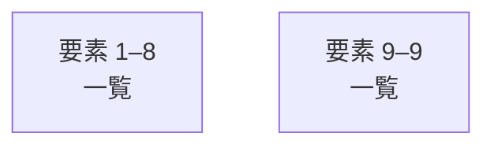

# overall-architecture/n-tests-04d13f

[解析トップへ戻る](../../README.md)

確認したパス: `tests`。配下の登録ファイルは43件。

- `tests/animated-demos.test.mjs`（一覧のみ）
- `tests/art-direction.test.mjs`（一覧のみ）
- `tests/browser-check.py`（一覧のみ）
- `tests/conversion-path.test.mjs`（一覧のみ）
- `tests/draft-operation.test.mjs`（一覧のみ）
- `tests/fifteen-second-films.test.mjs`（一覧のみ）
- `tests/films.test.mjs`（一覧のみ）
- `tests/fixtures/sample-v1-ja.json`（一覧のみ）
- `tests/fixtures/sample-v1-ja.md`（一覧のみ）
- `tests/genie-lp.test.mjs`（一覧のみ）
- `tests/hero-layouts.test.mjs`（一覧のみ）
- `tests/home-flagship.test.mjs`（一覧のみ）
- `tests/home-v4.test.mjs`（一覧のみ）
- `tests/horio-premium.test.mjs`（一覧のみ）
- `tests/http.test.mjs`（一覧のみ）
- `tests/inquiries.test.mjs`（一覧のみ）
- `tests/inquiry-context-ui.test.mjs`（一覧のみ）
- `tests/inquiry-worker.test.mjs`（一覧のみ）
- `tests/lab-experience.test.mjs`（一覧のみ）
- `tests/lab-signature.test.mjs`（一覧のみ）
- `tests/noa.test.mjs`（一覧のみ）
- `tests/oathra-lp.test.mjs`（一覧のみ）
- `tests/outcome-first.test.mjs`（一覧のみ）
- `tests/owned-recording-response.test.mjs`（一覧のみ）
- `tests/owned-sites.test.mjs`（一覧のみ）
- `tests/premium-films.test.mjs`（一覧のみ）
- `tests/product-art-direction.test.mjs`（一覧のみ）
- `tests/product-landings.test.mjs`（一覧のみ）
- `tests/product-rhythms.test.mjs`（一覧のみ）
- `tests/proof-registry.test.mjs`（一覧のみ）
- `tests/recorded-result.test.mjs`（一覧のみ）
- `tests/redesign.test.mjs`（一覧のみ）
- `tests/sample-draft.test.mjs`（一覧のみ）
- `tests/showcase.test.mjs`（一覧のみ）
- `tests/signature-scene.test.mjs`（一覧のみ）

## 要素の説明

### group-1

このグループは表示用の区切りです。独立した実行モジュールではありません。

[詳細な図と説明を見る](group-1/README.md)

### group-2

このグループは表示用の区切りです。独立した実行モジュールではありません。

[詳細な図と説明を見る](group-2/README.md)

