# overall-architecture/n-tests-04d13f/group-1

[解析トップへ戻る](../../../README.md)

このグループは表示用の区切りです。独立した実行モジュールではありません。

```mermaid
graph TD
    n-tests-fixtures-4e5576["fixtures\ntests/fixtures"]
    n-tests-animated-demos-test-mjs-c552ca["animated-demos.test.mjs\ntests/animated-demos.test.mjs"]
    n-tests-art-direction-test-mjs-a2ee38["art-direction.test.mjs\ntests/art-direction.test.mjs"]
    n-tests-browser-check-py-0d61cc["browser-check.py\ntests/browser-check.py"]
    n-tests-conversion-path-test-mjs-7d1446["conversion-path.test.mjs\ntests/conversion-path.test.mjs"]
    n-tests-draft-operation-test-mjs-0edeb0["draft-operation.test.mjs\ntests/draft-operation.test.mjs"]
    n-tests-fifteen-second-films-test-mjs-5ad124["fifteen-second-films.test.mjs\ntests/fifteen-second-films.test.mjs"]
    n-tests-films-test-mjs-a68ae0["films.test.mjs\ntests/films.test.mjs"]
```

## 要素の説明

### n-tests-animated-demos-test-mjs-c552ca

実在パス: `tests/animated-demos.test.mjs`。1ファイル。

- `tests/animated-demos.test.mjs`

### n-tests-art-direction-test-mjs-a2ee38

実在パス: `tests/art-direction.test.mjs`。1ファイル。

- `tests/art-direction.test.mjs`

### n-tests-browser-check-py-0d61cc

実在パス: `tests/browser-check.py`。1ファイル。

- `tests/browser-check.py`

### n-tests-conversion-path-test-mjs-7d1446

実在パス: `tests/conversion-path.test.mjs`。1ファイル。

- `tests/conversion-path.test.mjs`

### n-tests-draft-operation-test-mjs-0edeb0

実在パス: `tests/draft-operation.test.mjs`。1ファイル。

- `tests/draft-operation.test.mjs`

### n-tests-fifteen-second-films-test-mjs-5ad124

実在パス: `tests/fifteen-second-films.test.mjs`。1ファイル。

- `tests/fifteen-second-films.test.mjs`

### n-tests-films-test-mjs-a68ae0

実在パス: `tests/films.test.mjs`。1ファイル。

- `tests/films.test.mjs`

### n-tests-fixtures-4e5576

実在パス: `tests/fixtures`。2ファイル。

- `tests/fixtures/sample-v1-ja.json`
- `tests/fixtures/sample-v1-ja.md`

