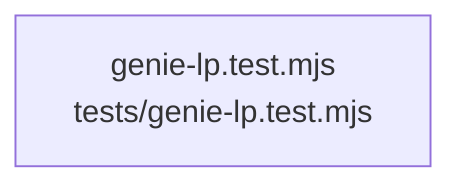

# overall-architecture/n-tests-04d13f/group-2

[解析トップへ戻る](../../../README.md)

このグループは表示用の区切りです。独立した実行モジュールではありません。

## 要素の説明

### n-tests-genie-lp-test-mjs-a03ecc

実在パス: `tests/genie-lp.test.mjs`。1ファイル。

- `tests/genie-lp.test.mjs`

